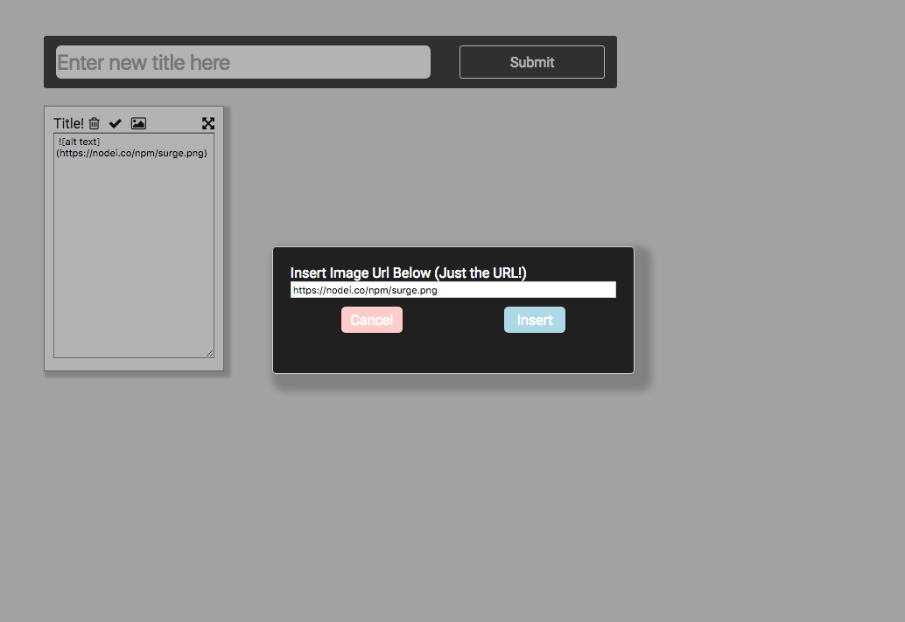
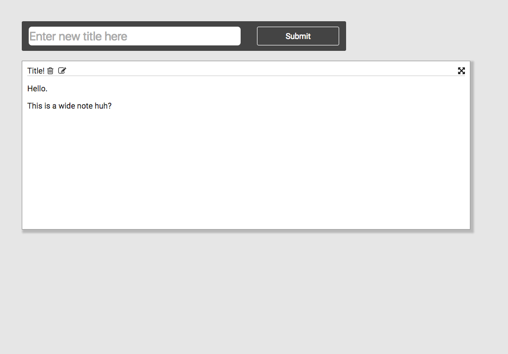

# React Notes App Part 1

## Robin Jayaswal, July 2016

### Description

For this project I created a simple note-taking app using React JS. I created an App component, a Note component, and a New Note Bar component. Together, these three components allowed me to build a web app where the user enters a title into the New Note Bar at the top of App, and a new Note is created. 

App holds most of the state, using an Immutable to hold objects with info about each note that gets passed to the Note components. It also holds the id to give the next note component, and the next z-index to give a note when a note is created or dragged (the z-index that will take a note to the top).

The Note holds some state relevant to itself, like whether it is in editing mode.

### What worked / didn’t work

Everything seemed to work pretty well.

### Extra Credit

* "Make your notes extra pretty"
	* I added a modal using react-modal that allows users to insert images using just the url, without having to type any markdown. Press the new Image Button at the top of a note when editing, and you will be presented with a modal. Enter an image url, and all the markdown is taken care of for you.

* "Come up with a way to deal with zIndex sorting"
	* When a new note is created, it will get the highest z-index of any note. When a note is dragged, it will get the highest z-index of any note. This way you can drag a note to bring it to the front.

* "Resizable notes"
	* When you are in editing mode for the notes, you can expand the textbox to change shape and size of note. When you exit editing mode, the note will retain the shape you just gave it.

